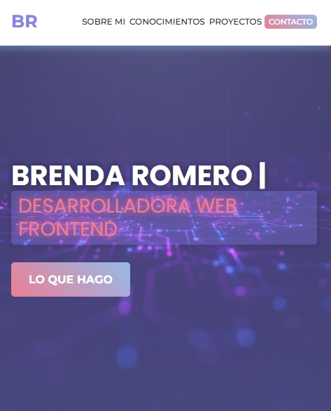

# 🌐 Portfolio Personal - Brenda Romero  

  

## 📌 Descripción  
Este proyecto corresponde al **Trabajo Práctico Integrador - Clase 18** del curso de Desarrollo Web Frontend.  
Se trata de un **portfolio personal responsive**, desarrollado con HTML y CSS, que funciona como carta de presentación, mostrando mi perfil, habilidades, proyectos y medios de contacto.  

## 🎯 Objetivo del Proyecto  
El propósito de este sitio es:  
- Presentar mi recorrido como desarrolladora web frontend.  
- Mostrar los proyectos realizados a lo largo del curso.  
- Centralizar mis conocimientos y habilidades técnicas.  
- Ofrecer un medio de contacto profesional.  

## 🛠️ Tecnologías Utilizadas  
- **HTML5**  
- **CSS3 (con responsive design)**  
- **Flexbox y Grid** para la maquetación  
- **Buenas prácticas semánticas**  

## 📂 Secciones del Portfolio  
- **Header** con navegación interna.  
- **Sección de presentación** (sobre mí).  
- **Sección de conocimientos** con tecnologías aprendidas.  
- **Sección de proyectos** con grilla de trabajos realizados.  
- **Formulario de contacto** con datos de comunicación.  
- **Footer** con navegación y enlaces externos.  

## 📱 Diseño Responsive  
El portfolio se adapta a distintos tamaños de pantalla:  
- **Versión desktop** con distribución en grillas y secciones amplias.  
- **Versión mobile** con reorganización en una sola columna para mayor legibilidad.  

## 🚀 Deploy  
El proyecto se encuentra deployado y accesible desde el siguiente enlace:  
👉 [mi-portafolio-brenda-romero.netlify.app](https://mi-portafolio-brenda-romero.netlify.app)  

## 📌 Requisitos de la consigna cumplidos  
✔ Header con links de navegación  
✔ Sección de presentación  
✔ Sección de habilidades  
✔ Cita  
✔ Sección de proyectos en grilla  
✔ Sección y formulario de contacto  
✔ Footer con links de navegación y externos  
✔ Diseño responsive  
✔ Deploy online  
✔ Repositorio con README  

## 👩‍💻 Autora  
**Brenda Romero**  
Desarrolladora Web Frontend  
